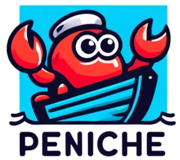

<p align="center">
  
</p>

# Peniche

The Peniche CLI tool is a powerful command-line interface designed to streamline the management of Rust workspaces, facilitating easy creation, management, and linking of crates within a workspace. Aimed at Rust developers who handle simple, complex or large-scale projects, Peniche helps automate and simplify various tasks in Rust project development.

## Features

- **Workspace Initialization**: Quickly set up a new workspace with all necessary configurations.
- **Crate Management**: Effortlessly create, delete, and manage crates within your workspace.
- **Dependency Linking**: Link crates within a workspace to manage dependencies efficiently.
- **Command Execution**: Run predefined or custom scripts across your workspace with support for concurrent execution.
- **Interactive Logging**: View progress and logs with rich formatting, color coding, and real-time updates.

## Installation

```bash
# Clone the repository
git clone https://github.com/kochmaxence/peniche.git

# Change directory
cd peniche

# Build the project
cargo build --release

# Optionally, install the CLI tool globally
cargo install --path .
```

## Usage

Peniche provides a set of subcommands to manage your Rust workspace:

```bash
# Initialize a new workspace
peniche init my_workspace .

# Add a new crate to the workspace
peniche new --lib my_crate
peniche new --bin my_crate

# Link crates within the workspace
peniche link crate_a crate_b

# Run scripts
peniche run deploy_script

# Run scripts in parallel
peniche run start_backend start_frontend start_db
```

Refer to the help command for more details on available commands and options:

```bash
peniche --help
```

## Development Status

Peniche is currently in **early development**. Many features are actively being developed, and the existing functionality is being refined. As the tool evolves, additional capabilities will be added to enhance its effectiveness and range of operations.

**Note**: The current state of the project may include temporary limitations or ongoing changes that could affect stability and feature availability. We appreciate your understanding and encourage feedback and contributions to help improve Peniche.

## Contributing

Contributions are welcome! If you have suggestions, bug reports, or would like to contribute code, please feel free to open an issue or pull request on our GitHub repository.

## License

Distributed under the MIT License. See `LICENSE` for more information.